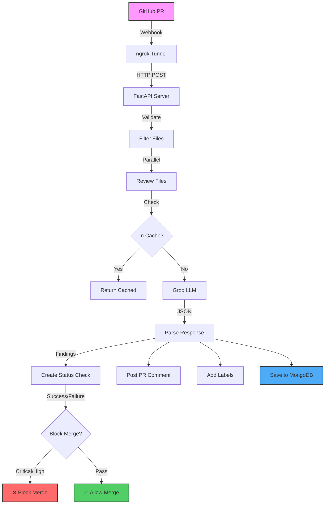

<div align="center">

# 🔒 PRGate

### Automated Security Review Bot for GitHub Pull Requests

[](https://www.python.org/)
[](https://fastapi.tiangolo.com/)
[](https://www.mongodb.com/)
[](https://groq.com/)

**AI-powered GitHub bot that automatically reviews PRs for security vulnerabilities and blocks merges if critical issues are found.**

</div>

---

## ✨ Features

| Feature | Description |
|---------|-------------|
| 🤖 **AI-Powered Analysis** | Uses Groq Llama 3.3 70B to detect 20+ vulnerability types |
| 🚫 **Merge Blocking** | Automatically blocks PRs with critical/high severity issues |
| 💬 **Smart Comments** | Posts detailed findings with CWE references and actionable fixes |
| 🏷️ **Auto-Labeling** | Adds severity labels like `security-critical` and `needs-security-review` |
| 📊 **Analytics** | Tracks developer patterns, repository risk scores, and historical trends |
| ⚡ **Performance** | Parallel reviews, intelligent caching, and rate limiting |

---

## 🚀 Install PRGate

### One-Click Installation

[](https://github.com/apps/prgate-security-bot/installations/new)

Click the badge above or visit [PRGate Security Bot](https://github.com/apps/prgate-security-bot) to install the app on your repositories.

---

## 📋 How It Works

### 1. Install the App
- Click the **Install** button on [PRGate Security Bot](https://github.com/apps/prgate-security-bot)
- Select the repositories you want to protect
- Grant the required permissions

### 2. Create a Pull Request
PRGate automatically:
- ✅ **Reviews every opened PR** for security vulnerabilities
- ✅ **Posts findings** as detailed comments
- ✅ **Adds severity labels** (security-critical, security-high, etc.)
- ✅ **Blocks merging** when critical/high severity issues are found

### 3. Review the Results

PRGate posts a comment like this on your PR:

## 🔒 PRGate Security Review

**Pull Request:** #123 - Add new feature
**Files Reviewed:** 1
**Issues Found:** 3 in 1 file(s)

### Severity Breakdown
- 🔴 Critical: 1
- 🟠 High: 1
- 🟡 Medium: 1

### 📋 Detailed Findings

#### 📄 `vulnerable.py`

1. 🔴 CRITICAL - hardcoded_secret
   **Issue:** API key hardcoded in source code
   **Fix:** Use environment variables
   **CWE:** 798

2. 🟠 HIGH - sql_injection
   **Issue:** SQL injection vulnerability
   **Fix:** Use parameterized queries
   **CWE:** 89

## 🚫 Merge Blocked
This PR contains critical or high severity security issues and cannot be merged.

---

## 🛠️ Technologies Used

| 🏷️ Component | 🔧 Technology | 📝 Description |
|--------------|---------------|----------------|
| ⚡ Web Framework | FastAPI + Uvicorn | High-performance async API server |
| 🤖 AI/LLM | Groq (Llama 3.3 70B) | Security vulnerability detection |
| 📦 GitHub | PyGithub | PR, comment, and status management |
| 🗄️ Database | MongoDB + Motor | Async document storage |
| ✅ Validation | Pydantic | Type-safe data validation |
| 🔗 Tunneling | ngrok | Local webhook testing |
| 🐍 Language | Python 3.13+ | Core programming language |
| 💾 Caching | In-Memory Dictionary | Review result caching |
| ⏱️ Rate Limiting | Custom Implementation | API request throttling |
| 🔄 Async | asyncio + ThreadPool | Parallel file processing |

---

## 🏗️ Architecture


### Component Details

- **Webhook Receiver** → FastAPI → Incoming GitHub events
- **LLM Processor** → Groq Llama 3.3 70B → Security analysis
- **Cache** → In-Memory Dictionary → Repeated code review caching
- **Database** → MongoDB → Persistent storage
- **Queue** → Async ThreadPool → Parallel file processing
- **Rate Limiter** → Custom → API abuse prevention

---

## 🔍 Detected Vulnerabilities

### 🔴 CRITICAL
- SQL Injection (CWE-89)
- Hardcoded Secrets (CWE-798)
- Command Injection (CWE-78)
- XXE Injection (CWE-611)
- Insecure Deserialization (CWE-502)

### 🟠 HIGH
- Path Traversal (CWE-22)
- Weak Cryptography (CWE-327)
- LDAP Injection (CWE-90)
- Open Redirect (CWE-601)

### 🟡 MEDIUM
- XSS (CWE-79)
- CSRF (CWE-352)
- Insecure CORS

## 📦 Installation

### Prerequisites

- Python 3.13+
- MongoDB
- Groq API Key
- GitHub Personal Access Token

---

### 1. Clone Repository

```bash
git clone https://github.com/mdjaved24/prgate.git
cd prgate
- Missing Rate Limiting
```

### 2. Create Virtual Environment

```bash
python -m venv venv
venv\Scripts\activate
```

### 3. Install Dependencies

```bash
pip install -r requirements.txt
```

### 4. Configure Environment
- Create a .env file:
```bash
GROQ_API_KEY=gsk_xxxxxxxxxxxxx
GITHUB_TOKEN=github_pat_xxxxxxxxxxxxx
MONGODB_URL=mongodb://localhost:27017
MONGODB_DB_NAME=pr_gate
MONGODB_ENABLED=true
```

### 5. Start MongoDB

```bash
docker run -d -p 27017:27017 --name mongodb mongo:latest
```

### 6. Run Application

```bash
cd app
python main.py
```

### 7. Expose with ngrok (Development)

```bash
ngrok http 8000
```

**Note:** The virtual environment activation command shown is for **Windows**. For **Linux/Mac**, use:

```bash
python3 -m venv venv
source venv/bin/activate
```
---

## 🔧 GitHub Configuration

### 1. Create Personal Access Token

```bash
Settings → Developer settings → Personal access tokens → Fine-grained tokens
```

### Required Permissions

| Permission | Access Level |
|------------|--------------|
| Pull requests | Read and write |
| Issues | Read and write |
| Commit statuses | Read and write |
| Contents | Read-only |
| Metadata | Read-only |

---

### 2. Configure Webhook

| Setting | Value |
|---------|-------|
| Payload URL | `https://your-domain.com/git/webhook` |
| Content type | `application/json` |
| Events | Pull requests, Ping |

---

### 3. Set Branch Protection

Navigate to: `Settings → Branches → Add branch protection rule`

**Enable these options:**

- ✅ Require a pull request before merging
- ✅ Require status checks to pass before merging
- ✅ Select `PRGate Security Review`

---

## 📡 API Endpoints

| Endpoint | Method | Description |
|----------|--------|-------------|
| `/` | GET | Health check |
| `/git/health` | GET | Service status |
| `/git/webhook` | POST | GitHub webhook receiver |
| `/git/git_user/{username}` | GET | Get GitHub user information |
| `/git/cache/stats` | GET | Cache statistics |
| `/git/cache/clear` | POST | Clear all cache |
| `/git/stats/developer/{username}` | GET | Developer analytics |
| `/git/stats/repository/{repository}` | GET | Repository analytics |
| `/git/review/{review_id}` | GET | Get review details |

---

## ⚡ Performance Metrics

| Metric | Value |
|--------|-------|
| First review time | 2-5 seconds per file |
| Cached review time | <0.1 second |
| Cache TTL | 1 hour |
| Max concurrent reviews | 3 files |
| Rate limit | 10 requests per minute per repository |

---
## 📁 Project Structure

```
prgate/
├── main.py
├── requirements.txt
├── .env
├── git_hub/
│   ├── __init__.py
│   ├── client.py
│   ├── pr_fetcher.py
│   ├── status_checks.py
│   └── pr_comment.py
├── llm/
│   ├── __init__.py
│   ├── prompts.py
│   ├── parser.py
│   └── reviewer.py
├── logs/
│   ├── app.log
│   ├── audit.log
│   ├── cache.log
│   ├── database.log
│   ├── error.log
│   ├── github.log
│   ├── llm.log
│   └── pr_fetcher.log
│   ├── review.log
│   ├── webhook.log
├── models/
│   ├── __init__.py
│   └── findings.py
├── utils/
│   ├── __init__.py
│   ├── rate_limiter.py
│   ├── logger.py
│   └── cache.py
└── database/
    ├── __init__.py
    ├── mongodb_client.py
    └── repository.py
```

### File Descriptions

| File | Purpose |
|------|---------|
| `main.py` | FastAPI application entry point |
| `requirements.txt` | Python package dependencies |
| `.env` | Environment variables configuration |
| `git_hub/client.py` | GitHub API client wrapper |
| `git_hub/pr_fetcher.py` | Webhook request handlers |
| `git_hub/status_checks.py` | Commit status & label management |
| `git_hub/pr_comment.py` | PR comment formatting |
| `llm/prompts.py` | AI prompt templates |
| `llm/parser.py` | JSON response parsing |
| `llm/reviewer.py` | Groq LLM integration |
| `models/findings.py` | Pydantic data models |
| `utils/rate_limiter.py` | API rate limiting |
| `utils/cache.py` | Review result caching |
| `database/mongodb_client.py` | MongoDB connection manager |
| `database/repository.py` | Database operations |

---

## 📝 Environment Variables

| Variable | Required | Default | Description |
|----------|----------|---------|-------------|
| `GROQ_API_KEY` | ✅ Yes | - | Groq API key for LLM access |
| `GITHUB_TOKEN` | ✅ Yes | - | GitHub Personal Access Token |
| `MONGODB_URL` | ❌ No | `mongodb://localhost:27017` | MongoDB connection string |
| `MONGODB_DB_NAME` | ❌ No | `pr_gate` | Database name |
| `MONGODB_ENABLED` | ❌ No | `true` | Enable/disable database logging |
| `CACHE_MAX_SIZE` | ❌ No | `100` | Maximum cache entries |
| `CACHE_TTL_SECONDS` | ❌ No | `3600` | Cache time-to-live in seconds |
| `RATE_LIMIT_MAX_REQUESTS` | ❌ No | `10` | Maximum requests per time window |
| `RATE_LIMIT_TIME_WINDOW` | ❌ No | `60` | Rate limit time window in seconds |

---

### Sample `.env` File

```env
# Required
GROQ_API_KEY=gsk_xxxxxxxxxxxxx
GITHUB_TOKEN=github_pat_xxxxxxxxxxxxx

# Optional - MongoDB
MONGODB_URL=mongodb://localhost:27017
MONGODB_DB_NAME=pr_gate
MONGODB_ENABLED=true

# Optional - Cache
CACHE_MAX_SIZE=100
CACHE_TTL_SECONDS=3600

# Optional - Rate Limiting
RATE_LIMIT_MAX_REQUESTS=10
RATE_LIMIT_TIME_WINDOW=60
```
---
## 📊 Logging System

PRGate includes a comprehensive logging system to monitor, debug, and audit all operations.

### Log Files

| Log File | Purpose |
|----------|---------|
| `logs/app.log` | Application lifecycle events |
| `logs/webhook.log` | Incoming webhook events |
| `logs/review.log` | PR review processing |
| `logs/llm.log` | LLM operations and caching |
| `logs/database.log` | MongoDB operations |
| `logs/github.log` | GitHub API calls |
| `logs/cache.log` | Cache operations |
| `logs/error.log` | Errors and exceptions |
| `logs/audit.log` | Security audit trail |
| `logs/pr_fetcher.log` | PR fetch operations |

### Log Levels

| Level | Usage |
|-------|-------|
| `DEBUG` | Detailed cache operations, LLM parsing, file filtering |
| `INFO` | Normal operations, review completion, database saves |
| `WARNING` | Rate limiting, merge blocking, retries |
| `ERROR` | Failed reviews, API errors, exceptions |

### View Logs

```bash
# View recent app logs
python view_logs.py --log app --lines 50

# Follow webhook logs in real-time
python view_logs.py --log webhook --follow

# Check audit trail
python view_logs.py --log audit --lines 100

# View errors only
python view_logs.py --log error --lines 50

# View LLM operations
python view_logs.py --log llm --lines 50 --follow
```
### Log Output Example
```bash
2026-05-22 09:56:38 | INFO     | webhook    | Webhook received - Event: pull_request, Delivery ID: 6bbeae70...
2026-05-22 09:56:38 | INFO     | review     | PR #6 - Review ID: a95de44e...
2026-05-22 09:56:38 | INFO     | review     |   Repository: mdjaved24/codesentry-test-repo
2026-05-22 09:56:38 | INFO     | review     |   Author: mdjaved24
2026-05-22 09:56:38 | INFO     | review     |   Action: synchronize
2026-05-22 09:56:42 | INFO     | review     | Total files changed: 1
2026-05-22 09:56:42 | INFO     | llm        | LLM review attempt 1/2
2026-05-22 09:56:46 | INFO     | llm        | Attempt 1 completed in 4.54s - Found 18 issues
2026-05-22 09:56:48 | WARNING  | review     | PR #6 - Merge blocked due to critical/high severity issues
2026-05-22 09:56:58 | INFO     | audit      | PR Review completed - #6, Findings: 18, Blocked: True, Time: 19.55s
```
---

## 🐛 Troubleshooting

### Webhook not received?

| Issue | Solution |
|-------|----------|
| ngrok URL incorrect | Verify ngrok is running and URL is correct |
| Webhook inactive | Check GitHub webhook settings, ensure it's enabled |
| Server not running | Run `python main.py` and check for errors |
| Network issues | Check firewall and internet connection |

### MongoDB connection failed?

| Issue | Solution |
|-------|----------|
| MongoDB not running | Run `docker ps` to check container status |
| Wrong connection string | Verify `MONGODB_URL` in `.env` file |
| Port conflict | Ensure port 27017 is not in use |
| Database disabled | Set `MONGODB_ENABLED=true` in `.env` |

### GitHub token errors?

| Issue | Solution |
|-------|----------|
| Invalid token | Regenerate token in GitHub settings |
| Expired token | Check token expiration date |
| Missing permissions | Verify all required permissions are granted |
| Wrong repository | Ensure token has access to the repository |

### LLM review failing?

| Issue | Solution |
|-------|----------|
| Invalid API key | Verify `GROQ_API_KEY` in `.env` |
| Rate limit exceeded | Wait and retry, or upgrade Groq plan |
| Network timeout | Check internet connection |
| Invalid code format | Ensure code patch is valid |

---

## 👥 Contributing

Contributions are welcome! Please follow these steps:

1. Fork the repository
2. Create a feature branch (`git checkout -b feature/amazing`)
3. Commit your changes (`git commit -m 'Add amazing feature'`)
4. Push to the branch (`git push origin feature/amazing`)
5. Open a Pull Request

### Development Setup

```bash
# Install development dependencies
pip install -r requirements-dev.txt

# Run tests
pytest tests/

# Run linting
flake8 .
```
---


## 📧 Contact & Support

| Platform | Link |
|----------|------|
| 📧 Email | mdjav077@gmail.com |
| 🐙 GitHub | [@mdjaved24](https://github.com/mdjaved24) |
| 📝 Issues | [Report Bug](https://github.com/mdjaved24/prgate/issues) |
| 💡 Feature Request | [Request Feature](https://github.com/mdjaved24/prgate/issues/new) |

---

### 🙏 Acknowledgments

- [Groq](https://groq.com/) for providing the LLM API
- [FastAPI](https://fastapi.tiangolo.com/) for the amazing web framework
- [PyGithub](https://pygithub.readthedocs.io/) for GitHub API integration
- [MongoDB](https://www.mongodb.com/) for database services

---

### ⭐ Show Your Support

If you found this project helpful, please give it a ⭐ on GitHub!

---

**Built to make code safer 🔒**
